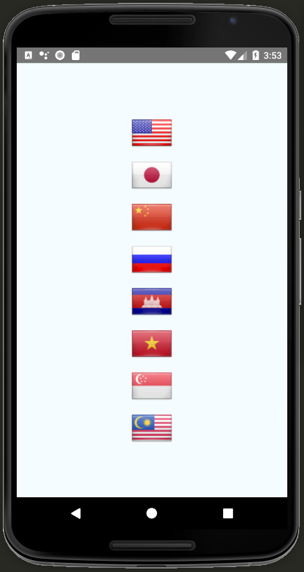

# react-native-flags-kit

React Native Flags Kit - React Native Flag component with all the flags in the world. [](https://www.npmjs.com/package/react-native-flags-kit) [](https://www.npmjs.com/package/react-native-flags-kit) [](http://opensource.org/licenses/MIT).



## Installation

`$ npm install react-native-flags-kit --save`

## Usage

```javascript
import Flag from 'react-native-flags-kit';

<Flag
  code="DE"
  size={32}
/>
```

## Full usage code

```javascript
import React, {Component} from 'react';
import {
  Platform,
  StyleSheet,
  View,
} from 'react-native';

import Flag from 'react-native-flags-kit';

type Props = {};
export default class App extends Component<Props> {
  render() {
    return (
      <View style={styles.container}>
        <Flag
          code="US"
          size={64}
        />
        <Flag
          code="JP"
          size={64}
        />
        <Flag
          code="CN"
          size={64}
        />
        <Flag
          code="RU"
          size={64}
        />
        <Flag
          code="KH"
          size={64}
        />
        <Flag
          code="VN"
          size={64}
        />
        <Flag
          code="SG"
          size={64}
        />
        <Flag
          code="MY"
          size={64}
        />
      </View>
    );
  }
}

const styles = StyleSheet.create({
  container: {
    flex: 1,
    justifyContent: 'center',
    alignItems: 'center',
    backgroundColor: '#F5FCFF',
    fontSize: 30,
  },
});
```

You can find the source code [here](./examples/FlagsKitBasic).

## Props

| Props | Type | Default | Description |
|:----------|:----------|:----------|:----------|
| code | string | | [The ISO code of a flag](https://www.translatorscafe.com/cafe/ISO-3166-Country-Codes.htm), for example "KH", "US" or "GB". |
| type | string (flat or shiny) | shiny | Display the flags shiny or flat. |
| size | number (16, 24, 32, 48 or 64) | 64 | The size of a flag in points (Note: Setting a different size will render the closest one - e.g. `17 -> 16`, `29 -> 32`). |
| style (optional) |  |  | Allows additional `Image` styles to be passed through. |

## Wrap Up

If you think any of the `react-native-flags-kit` can be improved, please do open a PR with any updates and submit any issues. Also, I will continue to improve this, so you might want to watch/star this repository to revisit.

## Contribution

We'd love to have your helping hand on contributions to `react-native-flags-kit` by forking and sending a pull request!

Your contributions are heartily ♡ welcome, recognized and appreciated. (✿◠‿◠)

How to contribute:

- Open pull request with improvements
- Discuss ideas in issues
- Spread the word
- Reach out with any feedback

## License

The MIT License [](https://opensource.org/licenses/MIT)
